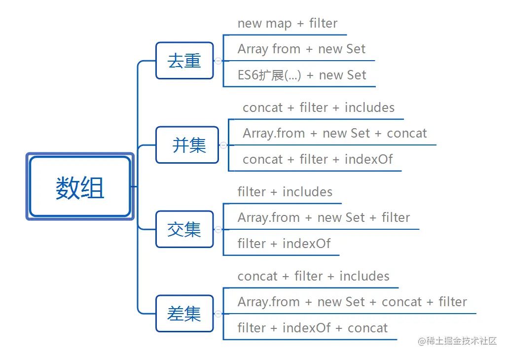

# 数组取值

## 两个数组
### 去重
> 1. new map + filter

```
//定义常量 res,值为一个Map对象实例
//返回arr数组过滤后的结果，结果为一个数组
//过滤条件是，如果res中没有某个键，就设置这个键的值为
const res = new Map();
const arr = [1,1,2,2,3,4,4,5,6,6,6,6,4,3];
const result = arr.filter((a) => !res.has(a) && res.set(a, 1));

console.log(result); //[1,2,3,4,5,6]
```
> 2. Array from + new Set
```
//通过Set对象，对数组去重，结果又返回一个Set对象
//通过from方法，将Set对象转为数组
const arr = [1,1,2,2,3,4,4,5,6,6,6,6,4,3];
const result = Array.from(new Set(arr));
console.log(result) //[1,2,3,4,5,6];
```
> 3. ES6扩展(...) + new Set
```
//通过Set对象，对数组去重，结果又返回一个Set对象
//通过es6扩展方法，拷贝参数对象的所有可遍历属性到新数组之中
const arr = [1,1,2,2,3,4,4,5,6,6,6,6,4,3];
const result = [...new Set(arr)];
console.log(result) //[1,2,3,4,5,6];
```

### 取并集
> 1-1. Array.from + new Set + ES6
```
let a=new Set([1,2,3,4,5]);
let b=new Set([1,2,3,4,5,6,7,8,9]);
let arr = Array.from(new Set([...a, ...b]));

console.log('arr',arr);  //[1,2,3,4,5,6,7,8,9]
```
> 1-2. Array.from + new Set + concat
```
// ES6中新增的一个Array.from方法，用于将类数组对象和可遍历对象转化为数组,
// 只要类数组有length长度，基本都可以转化为数组。结合Set结构实现数学集求解
let a = [1, 2, 3];
let b = [2, 4, 5];
let aSet = new Set(a);
let bSet = new Set(b)
// 并集
let union = Array.from(new Set(a.concat(b)));
console.log(union); // [1,2,3,4,5]
```
> 2. concat + filter + includes
```
let a = [1, 2, 3];
let b = [2, 4, 5];
let union = a.concat(b.filter(v => !a.includes(v)));
console.log(union) // [1,2,3,4,5]
```
> 3. concat + filter + indexOf
不考虑NaN（数组中不含NaN）
```
let a = [1, 2, 3];
let b = [2, 4, 5];
let union = a.concat(b.filter(v=> a.indexOf(v) === -1));
console.log(union); // [1,2,3,4,5]
```
考虑NaN（数组中含NaN）
```
let a = [1, 2, 3, NaN];
let b = [2, 4, 5, NaN];
let aHasNaN = a.some(v => isNaN(v));
let bHasNaN = b.some(v => isNaN(v));
// 并集
let union = a.concat(b.filter(v=> a.indexOf(v) === -1 && !isNaN(v)))
             .concat(!aHasNaN & bHasNaN ? [NaN] : []);

console.log(union); // [1, 2, 3, NaN, 4, 5]
```

### 取交集
> 1-1. Array.from + new Set + filter
```
let a=new Set([1,2,3,4,5]);
let b=new Set([1,2,3,4,5,6,7,8,9]);
let arr = Array.from(new Set([...b].filter(x => a.has(x))));

console.log('arr',arr);   //[1,2,3,4,5]
```
> 1-2. Array.from + new Set + filter
```

let a = [1, 2, 3];
let b = [2, 4, 5];
let aSet = new Set(a);
let bSet = new Set(b);
// 交集
let intersection = Array.from(new Set(a.filter(v => bSet.has(v))));

console.log(intersection); // [2]
```

> 2. filter + includes
```
let a = [1, 2, 3];
let b = [2, 4, 5];
let intersection = a.filter(v => b.includes(v));
console.log(intersection); // [2]

```

### 取差集
```
let a=new Set([1,2,3,4,5]);
let b=new Set([1,2,3,4,5,6,7,8,9]);
let arr = Array.from(new Set([...b].filter(x => !a.has(x))));

console.log('arr',arr);  //[6,7,8,9]
```

## 两个数组对象
### 取交集
```
let a=[{id:1,a:123,b:1234},{id:2,a:123,b:1234}];
let b=[{id:1,a:123,b:1234},{id:2,a:123,b:1234},{id:3,a:123,b:1234},{id:4,a:123,b:1234}];
let arr = [...b].filter(x => [...a].some(y => y.id === x.id));

console.log('arr',arr);  
//[{id:1,a:123,b:1234},{id:2,a:123,b:1234}]
```

### 取差集
```
let a=[{id:1,a:123,b:1234},{id:2,a:123,b:1234}];
let b=[{id:1,a:123,b:1234},{id:2,a:123,b:1234},{id:3,a:123,b:1234},{id:4,a:123,b:1234}];
let arr = [...b].filter(x => [...a].every(y => y.id !== x.id));

console.log('arr',arr);  
//[{id:3,a:123,b:1234},{id:4,a:123,b:1234}]
```

## 总结
 