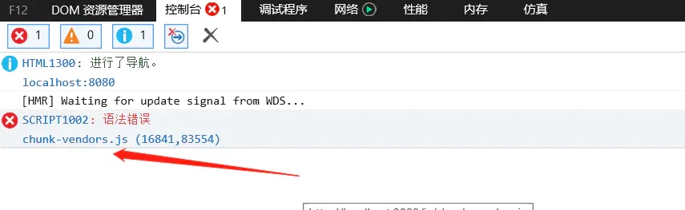

# Vue2

## vue2兼容IE10+
> 使用vue2+ vue-cli3+ 搭建vue项目
> 1.安装 core-js   2.降低 axios 版本

```
npm i core-js
npm i axios@0.19.2 -D   //安装指定版本

// main.js
// IE10兼容 with polyfills
import 'core-js/stable'
import 'regenerator-runtime/runtime'

// 设置：babel.config.js。
module.exports = {
  presets: [
    [
    '@vue/cli-plugin-babel/preset',
    {
      useBuiltIns: 'entry',
      corejs: 3
    }
    ]
  ],
  plugins: [ ]
}

// 设置：vue.config.js
module.exports = {
    // 添加transpileDependencies配置属性，按需添加需要编码的内容
    transpileDependencies: ['*'],
}
```
以上配置，能解决IE上这个报错，如图：

 